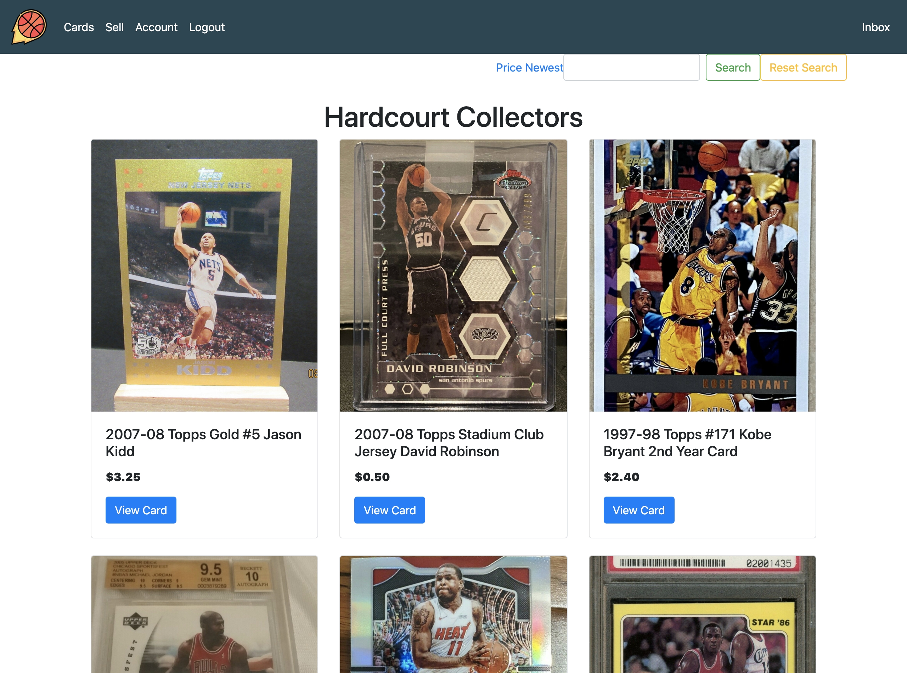
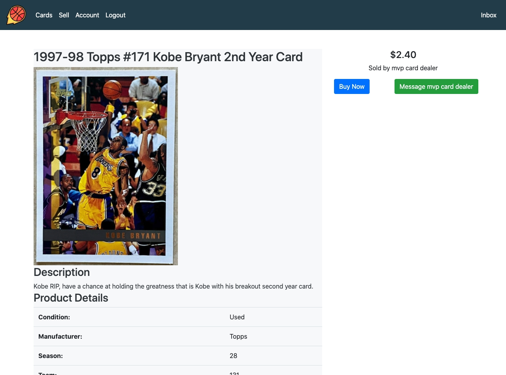
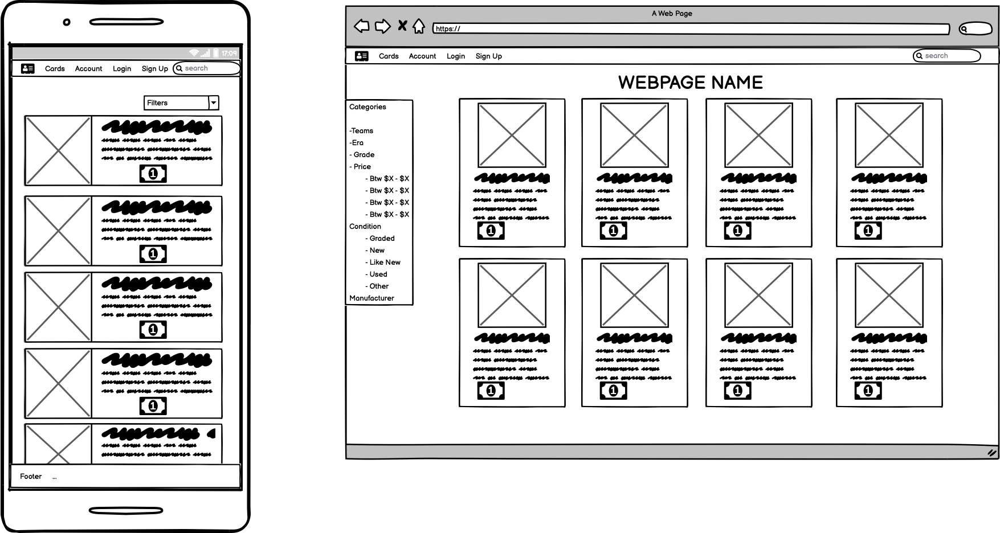

# User Stories (R12)

**General User**

- As a user I can instant message/chat with a seller to ask them questions about an item to enhance my confidence
- As a user I want to be notified of when a I have an unread message in my inbox, in order to know when someone has responded to my message
- As a user, I want to be able to access my account information and update it as need be so that I can maintain my account
-As a user, I want to create an account in order to become a seller and a buyer on the marketplace
- As a user, I want to have a secure login that requires an email and password
- As a user, I want to be able to log out of my account to protect any one accessing my machine and selling or buying cards through my account
- As a user I can see all the cards for sale on the index page so that I can browse without loggin in

**Buyers**
- As a user I can inspect individual cards (show page) to get description details from the index page so that I can feel confident in what I am purchasing
- As a user I can browse cards buy critera (rookies, holgraphic, graded, team) so that I can streamline my experience
- As a user I can securely buy cards (stripe) so that I can add to my collection
- As a user I want to be able to search for cards, in order to quickly find the cards I am looking for

**Sellers**
- As a user I can sell cards so that I can make money
- As a user I can images of my cards for sale so that I can make buyers feel confident
- As a user I can sell a edit my card if need be to make selling more convenient 
- As a user I do not want to see the option to purchase my own cards
- As a user I want to be able to delete my card so that I can change my mind about selling it prior to a sale

**Sprinkle Stories**
- As a user I can do all of the above on mobile first so that I don't need to be on my computer

# Problem that needs solving & why it needs solving (R7 & R8)

Currently there are no dedicated marketplaces to sell basketball cards. Sellers and buyers are forced to user marketplaces like Ebay, Gumtree or Auction houses to buy and sell basketball cards. Meaning that the buyers are forced to check all these locations for the cards they want and the sellers therefore lose out on demand as buyers might not know that certain cards are listed in certain locations. 

This means basketball cards can get lost in the sea of other items on these marketplaces and the user experience isn't built to highlight the unique features of each card.

Thus this problem needs to be solved so that the buying, selling and finding of cards can be centralised in one place. This means that sellers can get the best price for their cards and buyers can easily find the cards they are looking for. 

This app aims to solve this issue by providing basketball card collectors with a two sided marketplace to find, buy and sell basketball cards.

# Heroku: (R9) 
[Here](https://hardcourt-collectors.herokuapp.com/)

# Github: (R10)
[Here](https://github.com/pin0S/trading-card-store)

# Description (R11)

## Purpose

The purpose of this marketplace is to provide a free and accessible platform for basketball card collectors to be able to find, buy and sell basketball cards. 

## Functionality / features

**Acounts:** Users can create free accounts. This account will give the user access to full site functionality without it the user can only browser items, they must be logged in to purchases or sell cards. 

If a User attempts to sell or buy a card without an account they will be prompted to log in or sign up for an account. 

Once a user has an account they can edit their details in the future using the option in the account page.

**Cards:** Any logged-in users can sell cards. Cards, have images and other important metadata that must be entered before the card is submitted ot the site.

Logged-in users can also buy cards. 

**Messaging:** Users who are logged-in are able to message the seller of a particular card from a link on the cards listing page. Users are notified when they have a new message with a coloured tab in the nav-bar or in the inbox page with an unread notification with the number of unread messages from a user.

**Pagination:** To speed up the loading of the site and so that users are not having to infinitely scroll through the all the available cards on the site pagination ensures only 12 cards per page are loaded.

**Tracking:** Users who are logged-in can keep track of the cards the currently have for sale, the cards they have purchased and the cards they have sold in their account page. This is all availablt through the accounts page.

**Search/filtering:** Users can search for cards based an queries contained in the title or the description of a card. In the future I would like to implement it so it can also look through the manufacture, team and season.

Users can also filter by price and new ascending and descending. This allows users to better search for cards within their budget and also to quickly see what new cards have been added to the site. 

## Sitemap


## Screenshots

## Home Page logged in User


## Home Page not signed in


## Home Page sorted by price descending 


## Home Page search term Rookie


## Login Page


## Sign Up Page


## Sign Up Page


## Inbox Page


## Inbox Unread Message Page


## Messaging Page


## Individual Card Page Buyer


## Individual Card Page Seller


## Sell Card Page


## Stripe


## Successful purchase


## Target audience

The target audience for this application is basketball card collectors.

## Tech stack (Made this like Stackshare)

**Front-end:** HTML5, CSS3, SCSS, Embedded Ruby, Bootstrap, Javascript.

**Back-end:** Ruby 2.7.1, Ruby on Rails 6.0.3.4., Postgresql

**Deployment:** Heroku.

**Utilities:** Stripe, AWS S3.

**DevOps:** Git, Github, VS Code, Bundler, Balsamiq, Trello

# Wrieframes (R13)

The reasons for some differences between the wireframes and the finished sites is largely due to feature implementation. 
- Having not implemented the sidebar for card filtering, I felt it was a clean design and better use of space to have cards. Plus it is a basketball card site. 
- Not implementing the change password and delete account features from devise also changed the layout of the account page.

Also I didn't implement a footer as there was no content to put there thus its purpose would just be an athsethic one. 





This page didn't eventuate as it didn't make sense to have two different views for cards. In the future I'd like to implement the sidebar with category search features. 


# An ERD for your app (R14)


# Explain the different high-level components (abstractions) in your app (R15)

Hardcourt collectors is a two way marketplace built in Ruby on Rails. It utilises the Model, View and Controller architecture which handles passing of data to user views with logic. The model is where the data is processed, the UI handles some basic logic to restrict views based on user states and the controllers handle the key logic of the application. 

Hardcourt collectors uses a relational database managed through PostgreSQL. Within this there are multiple models. 

When a user arrives at the site, Devise assesses if the user is signed in (current_user) or not. The views an users access to certain features are restricted based on this state which can be seen in the screen shots showing logged in views or logged out. A vistor to the site can see all card available on the site and view each individual card without being logged in. If a user wishes to buy or sell cards they must log in to do so. If the user has an existing account they can sign in, if not they are able to sign up for an account. The sign up and log in is handled by Devise's authentication system. 

Users can sell cards in the app, each card must have a title, description, price (numerical greater than zero), condition, manufacturer, picture, team and season when submitting it for sale otherwise the user will not be able to list it. The app utilises Amazon's S3 services and rails active storage to handle image uploading. 

The application also has a messaging system so that users can directly contact the seller of a card to ask any questions they may have. This is managed through a join table that stores every conversation and its messages between two users. If a user receives a message the 'inbox' link of the navbar will turn yellow to inform the user of an unread message. There is also a unread message counter badge within the inbox itself. 

Users can search for cards based on specific terms within the title or description, they can also sort based on price of time created. This is managed through Ransack (gem). Cards are also paginated to restrict 12 cards per page, managed through 'Will paginate', this is to speed up the performance of the site.

Finally, if a User purchases a card the checkout is handled by Stripes API, along with Ultrahook (deployment only). The Payments are handled through a separate controller which record the buyer, seller and card so that information can be added to the order table so the purchased cards are removed from the homepage. After a successful purchase users are notified with a success page and they can then choose to continue browsing cards.

# Detail any third party services that your app will use (R16)

This application utilised the following third party services: 

**1. Devise:** User Authentication is handled by Devise. It was used as it is an industry standard and a comprehensive solution that is secure and requires minimal setup. User create and edit accounts through devise which handles validation of the parameters in the sign up form. It also allows users to log in. Finally it determines who the current user is that allows for different view logic accross the application. 
**1. Ransack:** This gem allows for sorting by price and time card listings were created at (both ascending and descending). It also allows users to search the card listings by querying the title and description. 
**1. Will paginate:** This gem restricts the amount of cards shown per page to 12. In works with ransack and will paginate based on sort and search. 
**1. Stripe API:** This API handles payments ensuring they are secure. The payments are passed outside of the application to Stripe, once complete users are directed back to the site.
**1. Amazon S3:** Allows for card image uploading. 
**1. Bootstrap:** The majority of styling on the site is handle by the bootstrap framework, there is a small amount of customer CSS in the application scss file. 
**1. Faker:** This Gem is used to generate the data for NBA teams and season tables. 

# Describe your projects models in terms of the relationships (active record associations) they have with each other

- A *user* has_many *cards*, a *card* belongs_to a *user* as a *seller*
- A *user* has_many *orders*, an *order* belongs to a *buyer* and a *seller* 
- A *user* (FK buyer) has_many *purchases*, an *order* belongs_to a *buyer*.
- A *user* (FK seller) has_many *sales*, an *order* belongs_to a *seller*.
- A *user* has_many *sold_cards*, through *sales*
- A *user* has_many *purchased_cards*, through *purchases*


- A *user* has_many *messages*, a *message* belongs_to a *user*.
- A *conversation* has_many *messages*, a *message* belongs_to a *conversation*.
- A *user* (FK sender) has_many *conversations*, a *conversation* belongs_to a *sender*.
- A *user* (FK recipient) has_many *conversations*, a *conversation* belongs_to a *recipient*.

- A *order* belongs_to a *card*
- A *card* has_one_attached *picture*, a *picture* belongs to a *card*
- A *card* has_one *season*, a *season* has_many *cards*
- A *card* has_one *team*, a *team* has_many *cards*

# Discuss the database relations to be implemented in your application (R18)

**Users:** There are many relationships that belong to the user table. The User table has a primary key `user_id` this is used (no pun intended) as foreign key in multiple related tables, the relations are not presented in the user table as to normalise the postgreSQL relational database. 

**Cards:** A card belongs to a user which is represented as a `seller_id` foreign key that is a `user_id`. Once a card is purchased a `buyer_id` foreign key is assigned as the `current_user` from the user table (`user_id`). The card table also contains a `team_id` and `season_id` foreign key which relates both to the teams and season table respectively. 

**Orders:** A order table has the primary key order_id. It has three foreign keys, `seller_id` and `card_id` relate to the cards table, while `buyer_id` relates to the user table. 

**Messages and Conversations:** Conversations belong to a sender and a recipient, this is assocaited through the foreign keys `sender_id` and `recipients_id`. Each of these keys referencesthe user id of the respective user based on the action.. There can only be one conversation between a sender and a recipent and messages are accumulated in that single conversation.

Messages are recorded in the messages table, each message belongs to a conversation hence therefore there is a `conversation_id` foreign key. Messages also has a `user_id` foreign key to track which user is the sender and which is the receiver.

**Active Record:** Is some rails magic! But that aside that active record tables are polymorphic tables which in our apps case relates to the uploading of images. They are implemented only as as has_one_attached `picture` and belongs_to `card` relationship in the cards table. 


# Provide your database schema design (R19)

## active_storage_attachments

``` t.string "name", null: false
    t.string "record_type", null: false
    t.bigint "record_id", null: false
    t.bigint "blob_id", null: false
    t.datetime "created_at", null: false
    t.index ["blob_id"], name: "index_active_storage_attachments_on_blob_id"
    t.index ["record_type", "record_id", "name", "blob_id"], name: "index_active_storage_attachments_uniqueness", unique: true
```

## active_storage_blobs

``` t.string "key", null: false
    t.string "filename", null: false
    t.string "content_type"
    t.text "metadata"
    t.bigint "byte_size", null: false
    t.string "checksum", null: false
    t.datetime "created_at", null: false
    t.index ["key"], name: "index_active_storage_blobs_on_key", unique: true
```

## Cards

``` t.string "title"
    t.string "description"
    t.integer "condition"
    t.integer "manufacturer"
    t.datetime "created_at", precision: 6, null: false
    t.datetime "updated_at", precision: 6, null: false
    t.float "price"
    t.bigint "season_id", null: false
    t.bigint "team_id", null: false
    t.boolean "purchased", default: false
    t.bigint "seller_id"
    t.bigint "buyer_id"
    t.index ["buyer_id"], name: "index_cards_on_buyer_id"
    t.index ["season_id"], name: "index_cards_on_season_id"
    t.index ["seller_id"], name: "index_cards_on_seller_id"
    t.index ["team_id"], name: "index_cards_on_team_id"
```
## Conversations 

```t.integer "sender_id"
    t.integer "recipient_id"
    t.datetime "created_at", precision: 6, null: false
    t.datetime "updated_at", precision: 6, null: false
```

## Messages

```t.text "body"
    t.bigint "conversation_id"
    t.bigint "user_id"
    t.datetime "created_at", precision: 6, null: false
    t.datetime "updated_at", precision: 6, null: false
    t.boolean "read", default: false
    t.index ["conversation_id"], name: "index_messages_on_conversation_id"
    t.index ["user_id"], name: "index_messages_on_user_id"
```

## Orders

```t.datetime "created_at", precision: 6, null: false
    t.datetime "updated_at", precision: 6, null: false
    t.bigint "seller_id", null: false
    t.bigint "buyer_id", null: false
    t.bigint "card_id", null: false
    t.string "striperef"
    t.string "receipt"
    t.index ["buyer_id"], name: "index_orders_on_buyer_id"
    t.index ["card_id"], name: "index_orders_on_card_id"
    t.index ["seller_id"], name: "index_orders_on_seller_id"
```

## Seasons

```t.string "years"
    t.datetime "created_at", precision: 6, null: false
    t.datetime "updated_at", precision: 6, null: false
```

## Teams

```t.string "team"
    t.datetime "created_at", precision: 6, null: false
    t.datetime "updated_at", precision: 6, null: false
```

## Users

```t.string "email", default: "", null: false
    t.string "encrypted_password", default: "", null: false
    t.string "reset_password_token"
    t.datetime "reset_password_sent_at"
    t.datetime "remember_created_at"
    t.datetime "created_at", precision: 6, null: false
    t.datetime "updated_at", precision: 6, null: false
    t.string "username"
    t.string "first_name"
    t.string "last_name"
    t.string "phone"
    t.string "street"
    t.string "suburb"
    t.string "state"
    t.string "country"
    t.string "postcode"
    t.index ["email"], name: "index_users_on_email", unique: true
    t.index ["reset_password_token"], name: "index_users_on_reset_password_token", unique: true
```

# Describe the way tasks are allocated and tracked in your project (R20)

Trello: [Here](https://trello.com/b/RLhVeBsx/trading-card-store)